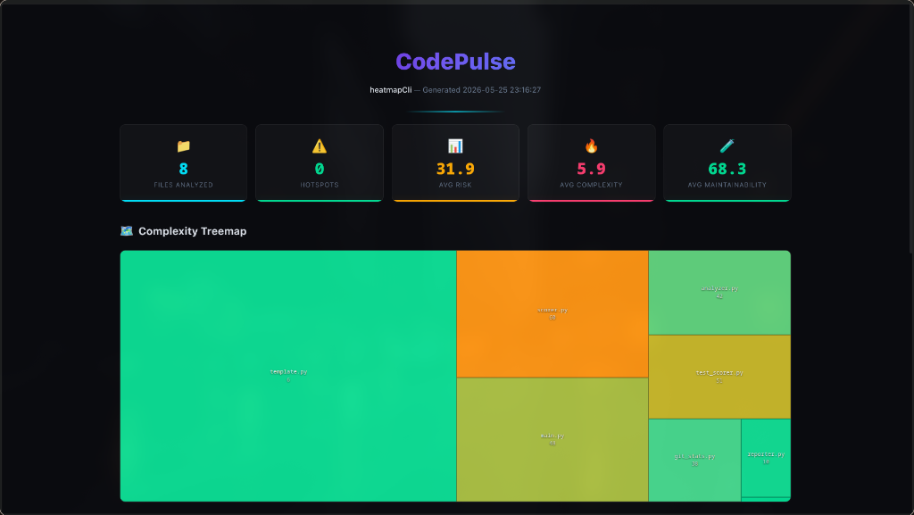
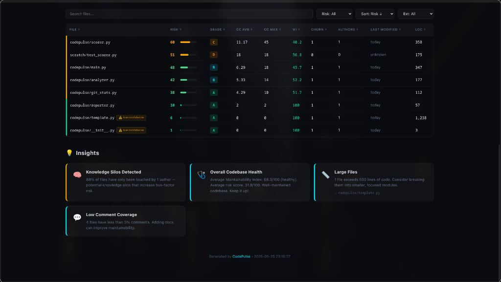

<p align="center">
  
</p>

<h1 align="center">🔬 CodePulse</h1>

<p align="center">
  <strong>Interactive code complexity heatmaps for any Git repository.</strong><br>
  <em>One command. Zero config. Beautiful reports.</em>
</p>

<p align="center">
  
</p>
<p align="center">
  
</p>

<p align="center">
  <a href="#-install">Install</a> •
  <a href="#-quick-start">Quick Start</a> •
  <a href="#-features">Features</a> •
  <a href="#-html-report">HTML Report</a> •
  <a href="#-cli-options">CLI Options</a>
</p>

---

## ✨ What is CodePulse?

CodePulse analyzes your codebase and generates a **self-contained, interactive HTML report** visualizing:

- 🧮 **Cyclomatic Complexity** — how tangled is your logic?
- 🩺 **Maintainability Index** — how easy is this code to work with?
- 🔥 **Git Churn** — which files change the most?
- 💀 **Risk Score** — a composite 0-100 score combining all metrics

Think of it as an **X-ray for your codebase** — it surfaces the files that are complex, hard to maintain, AND frequently changed (a.k.a. "hotspots").

The HTML report is **fully standalone** — no internet required, no CDN, works offline. Beautiful enough to share screenshots of.

---

## 📦 Install

```bash
# With pip
pip install codepulse

# With pipx (recommended for CLI tools)
pipx install codepulse

# From source
git clone https://github.com/ARYAN007H/codepulse.git
cd codepulse
pip install -e .
```

**Requirements:** Python 3.10+, Git (optional — use `--no-git` without it)

---

## 🚀 Quick Start

```bash
# Analyze the current directory
codepulse

# Analyze a specific repo
codepulse --path /path/to/your/repo

# Open the report in your browser automatically
codepulse --open
```

That's it. One command, zero config. CodePulse discovers Python files, analyzes them, queries git history, and generates an interactive report.

---

## 🎯 Features

### Terminal Output
CodePulse shows a **real-time progress bar** and a gorgeous **Rich-powered summary table**:

```
╭────────────────────────── CodePulse Report ──────────────────────────╮
│  📁 Repo:       my-project                                          │
│  🐍 Files:      47 files analyzed                                   │
│  ⚠️  Hotspots:   6 critical files found                              │
│  💀 Riskiest:   src/legacy/parser.py  [Risk: 91/100]                │
│  📊 Avg Risk:   34.2/100                                            │
╰──────────────────────────────────────────────────────────────────────╯
```

### HTML Report
The hero of the tool — a premium dark-mode dashboard with:

- **🗺️ Interactive Treemap** — files sized by LOC, colored by risk score
- **📊 Animated Stats Cards** — key metrics with count-up animations
- **📋 Sortable & Filterable Table** — search, filter by risk/extension, sort by any column
- **🔍 Function-Level Drill-Down** — click any file to see per-function complexity
- **💡 Auto-Generated Insights** — hotspot detection, knowledge silo warnings, folder analysis
- **🎨 Glassmorphism UI** — looks like a premium SaaS dashboard

### Metrics Collected

| Metric | Source | Description |
|--------|--------|-------------|
| Cyclomatic Complexity | `radon` | How many independent paths through the code |
| Maintainability Index | `radon` | 0-100 score (higher = more maintainable) |
| Lines of Code | `radon` | Total, code, blank, and comment lines |
| Git Churn | `gitpython` | How many commits touched each file |
| Author Count | `gitpython` | How many developers worked on each file |
| Risk Score | Composite | Weighted combination of all metrics (0-100) |

### Calibrated Risk Score Formula

To prevent false alarms in clean repositories and accurately flag real hotspots in massive repositories, CodePulse uses an absolute-calibrated risk formula:

#### 1. Composite Weights
*   **With Git**: `risk = (cc_risk * 0.40) + (mi_risk * 0.35) + (churn_risk * 0.20) + (loc_risk * 0.05)`
*   **Without Git**: `risk = (cc_risk * 0.50) + (mi_risk * 0.40) + (loc_risk * 0.10)`

#### 2. Component Calculations
*   **Logical Complexity Risk (`cc_risk`)**: Combines average cyclomatic complexity and worst-case function complexity, scaled via soft exponential decay so extreme values remain differentiable instead of hitting a hard linear ceiling:
    $$cc\_risk = 100 \times \left(1 - e^{-\frac{avg\_cc \times 4.0 + max\_cc \times 1.5}{50}}\right)$$
*   **Readability & Maintainability Risk (`mi_risk`)**: Maps Radon's Maintainability Index (0-100) to risk. Safe fallback on stubs or empty files:
    $$mi\_risk = 100 - mi\_score$$
*   **Git Churn Risk (`churn_risk`)**: Absolute-relative hybrid that normalizes git commits against a floor of 15, preventing newly initialized repos with 1 commit from scoring maximum risk:
    $$churn\_risk = \frac{commit\_count}{\max(churn\_max, 15)} \times 100$$
*   **Code Size Risk (`loc_risk`)**: Absolute capped penalty to avoid relative scaling skewing small files:
    $$loc\_risk = \min\left(100.0, \frac{loc}{1000} \times 100\right)$$

---

## 🖥️ CLI Options

```
Usage: codepulse [OPTIONS]

Options:
  -p, --path PATH           Path to the repository to analyze [default: .]
  -e, --ext TEXT             File extensions to analyze (repeatable) [default: py]
  -d, --depth INTEGER        Git commits to consider for churn [default: 200]
  -o, --output TEXT          Output path for HTML report [default: codepulse-report.html]
  --no-git                   Skip git churn analysis
  --no-terminal-summary      Suppress terminal summary table
  --open                     Open report in browser after generation
  -v, --version              Show version and exit
  --help                     Show this message and exit
```

### Examples

```bash
# Analyze only TypeScript and JavaScript files
codepulse --ext ts --ext js

# Deep git history analysis (500 commits)
codepulse --depth 500

# Output to a custom path
codepulse --output analysis/report.html

# Non-git directory (complexity only)
codepulse --path ./legacy-code --no-git

# Full analysis + auto-open
codepulse --path ~/projects/my-app --open --depth 300
```

---

## 🧠 Understanding the Report

### Risk Tiers

| Score | Tier | Meaning |
|-------|------|---------|
| 0-30 | 🟢 Low | Healthy, well-maintained code |
| 31-60 | 🟡 Medium | Some complexity, worth monitoring |
| 61-80 | 🔴 High | Needs attention — refactor candidate |
| 81-100 | 💀 Critical | Urgent — high complexity, high churn |

### Complexity Grades (Radon Scale)

| Grade | CC Range | Meaning |
|-------|----------|---------|
| A | 1-5 | Simple, easy to understand |
| B | 6-10 | Well-structured, low risk |
| C | 11-15 | Moderate complexity |
| D | 16-20 | Complex, consider refactoring |
| E | 21-25 | Very complex, hard to test |
| F | 26+ | Untestable, refactor immediately |

### Auto-Generated Insights

CodePulse automatically detects patterns like:
- 🔥 **Hotspots**: Files that are both high-churn AND high-complexity
- 🧠 **Knowledge Silos**: Files touched by only one developer
- 📁 **Troubled Directories**: Folders with consistently high risk scores
- 📏 **Large Files**: Files exceeding 500 lines that could be split
- 💬 **Low Comments**: Under-documented code

---

## 🤝 Contributing

Contributions are welcome! See [CONTRIBUTING.md](CONTRIBUTING.md) for guidelines.

```bash
# Development setup
git clone https://github.com/ARYAN007H/codepulse.git
cd codepulse
python -m venv .venv
source .venv/bin/activate
pip install -e .
```

---

## 📄 License

MIT License — see [LICENSE](LICENSE) for details.

---

<p align="center">
  <sub>Built with ❤️ by <a href="https://github.com/ARYAN007H">ARYAN007H</a></sub>
</p>
